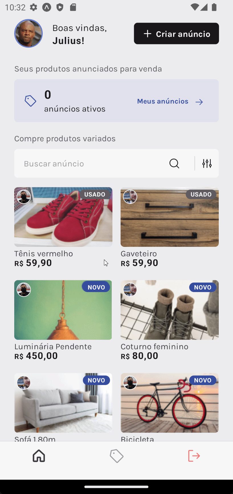
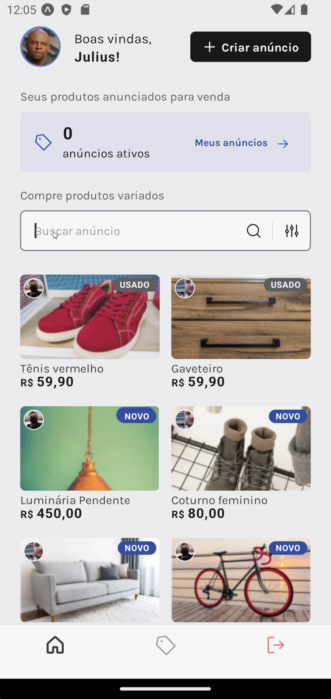

<h1 align="center">
	Ignite React Native Desafio 03 - MarketSpace
</h1>

  

   

  <a href="#-project">Project</a>   |   
  <a href="#rocket-Technologies">Technologies</a>   |   
  <a href="#-layout">Layout</a>   |   
  <a href="#-how-to-use">How to use</a>

## 💻 Project

This is a project developed based on Rocketseat Ignite ReactNative Challenge 03 - 2022.

<h1 align="center">

</h1>
<h1 align="center">

 

</h1>

## 🔖 Layout

To access the layout use [Figma](https://www.figma.com/file/CIvhyoji2zASYQKFGeWUEn/Marketspace/duplicate).

---

## 🚀 Technologies

This project was developed with the following technologies:

- [Node.js][nodejs]
- [TypeScript][typescript]
- [React][reactjs]
- [React Native][rn]
- [Expo][expo]

---

## ℹ️ How To Use

To clone and run this application, you'll need [Git](https://git-scm.com), [Node.js][nodejs] + [Yarn][yarn] installed on your computer.

---

Made by Julio Cesar Mowes 👋 [Get in touch!](https://www.linkedin.com/in/julio-cesar-mowes/)

[nodejs]: https://nodejs.org/
[typescript]: https://www.typescriptlang.org/
[expo]: https://expo.io/
[reactjs]: https://reactjs.org
[rn]: https://facebook.github.io/react-native/
[yarn]: https://yarnpkg.com/
